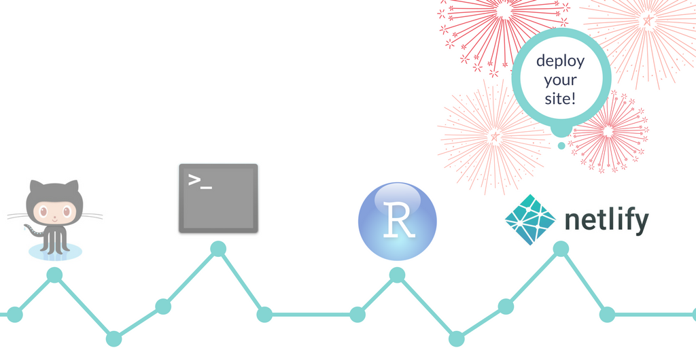

```{r setup, include=FALSE}
options(htmltools.dir.version = FALSE)
knitr::opts_chunk$set(tidy = FALSE, eval = FALSE)
```

#Étapes de la présentation


- **Créer** un compte [GitHub](https://github.com/);<br> <br>
- **Établir** la *communication* entre une session [Rstudio](https://www.rstudio.com/) et un répertoire `GitHub`;<br><br>
- **Transférer** les documents d’un projet `RStudio` dans un répertoire `GitHub`;<br><br>
- **Créer** un projet [BlogDown](https://bookdown.org/yihui/blogdown/) avec `RStudio` et le *connecter* à un répertoire `GitHub`;<br><br>
- **Charger** un *thème* de la plateforme [HUGO](https://themes.gohugo.io/) avec `Blogdown`;<br><br>
- **Créer** un compte sur [Netlify](https://www.netlify.com/);<br><br>
- **Établir** le *lien* entre un compte `GitHub` et un compte `Netlify`;<br><br>
- **Déployer** un site web développé sous `RStudio` à partir d’un répertoire `GitHub`.

---

#GitHub


---

#Create a GitHub repository

--

1. Open your [GitHub](https://github.com) account and create a new repository (initialize with a `README` but don't add `.gitignore` for now).

--

1. Go to the main page of the repository, and under the repository name, click the **Clone or download** button.

--

1. In the **Clone with HTTPs** section, click on the clipboard icon to copy the clone URL for the new repository (we will paste this text into the terminal in the next section.) 

---

#Command line/Terminal


---

# Clone the GitHub repository

--

We are going to create a local copy of the repository on your computer so you can make the two locations communicate (using the command line tool for Windows or the Terminal for Mac OS X).

--
    
1. Use `cd` to indicate the directory where you want your repository to be located

--

1. Type: `git clone [paste]`.

--

1. Close the command line/terminal.

--


For more details, see [clone your remote repository](https://help.github.com/articles/cloning-a-repository/).

---

#RStudio


---
class: center

#What is Blogdown ?


---

#Blogdown and Hugo

--

- Install the package `blogdown` from  RStudio or use `install.packages("devtools") devtools::install_github("rstudio/blogdown")`

--

- Install Hugo:

```
blogdown::install_hugo()
library(blogdown)
install_hugo()
```
--

- Use the `File` button in RStudio to select `File -> New Project -> Existing Directory`, then browse to the directory on your computer where your GitHub repository is and click on **Create Project**.

--

- Edit the `*gitignore` file. If you want to use Netlify to deploy your website, you should add the `public/` line ([for more info](https://bookdown.org/yihui/blogdown/version-control.html).)

```
.Rproj.user
.Rhistory
.RData
.Ruserdata
blogdown
.DS_Store # Thumbs.db for Windows users
public/ # for Netlify
```
---

#Build your site


---

#Choose a theme !

--

To choose a theme, see [Hugo themes](https://themes.gohugo.io/). To save time, see [Bookdown suggested themes](https://bookdown.org/yihui/blogdown/other-themes.html).

--

- You can use the default `lithium` theme: 

```
blogdown::new_site() 
```
--

- If you choose a theme, you can specify it while calling the `new_site` function. If you choose the `academic` theme:

```
blogdown::new_site(theme = "gcushen/hugo-academic", theme_example = TRUE)
```
--

- If you want to add a theme later:
    
```
library(blogdown)
new_site() # default theme 
install_theme("gcushen/hugo-academic", theme_example = TRUE, update_config = TRUE)
```
---

#Some basic edits

--

- Update project options by doing `Tools -> Project Options` and following [Bookdown instructions](https://bookdown.org/yihui/blogdown/rstudio-ide.html#fig:project-options).

--

- Edit the `baseurl` in your `config.toml` file. The URL *should always* end with a `/`:

```
baseurl = "https://website.com/"
baseurl = "/"
```
Feel free to edit other elements of the `config.toml` file ! For more details on configuration settings, read [Bookdown chapter on configuration](https://bookdown.org/yihui/blogdown/configuration.html).

--

- To view your new site locally, use the **Serve Site** button, or run `blogdown::serve_site`

---

class: inverse, center, middle

# Explore your new site

---
#Hugo directory structure

```{r}
.
├── archetypes
├── config
├── config.toml
├── content
├── public
├── static
├── themes
```

---
#Hugo directory structure

```{r}
.
├── archetypes
{{├── config}}
├── config.toml
├── content
├── public
├── static
├── themes
```

---
#Hugo directory structure

```{r}
.
├── archetypes
├── config
{{├── config.toml}}
├── content
├── public
├── static
├── themes
```
---
#Hugo directory structure

```{r}
.
├── archetypes
├── config
├── config.toml
{{├── content}}
    └── author
    └── home
    └── post
├── public
├── static
├── themes
```

---
#Hugo directory structure

```{r}
.
├── archetypes
├── config
├── config.toml
├── content
├── public
{{├── static}}
    └── img
├── themes
```

---

#Serve your site (locally)

--

- Console

```{r}
blogdown::serve_site()
```

--

- [The RStudio Addin `Serve Site`](https://rstudio.github.io/rstudioaddins/)

---
class: inverse, center, middle

#Edit your new site

For more details, see [Academic's page builder](https://sourcethemes.com/academic/docs/page-builder/)

---
class: inverse, center, middle

#Edit your new site
##Edit your home page

---
##Change your bio

```{r}
.
├── archetypes
├── config
├── config.toml
{{├── content}}
    └── author
      └── admin
        └── index.md
├── public
├── static
├── themes
```


---
##Update your CV

```{r}
.
├── archetypes
├── config
├── config.toml
{{├── content}}
    └── home
      └── accomplishments.md
      └── experience.md
      └── skills.md
      └── ...
├── public
├── static
├── themes
```

---
#Edit the navigation bar


```{r}
.
├── archetypes
{{├── config}}
    └── .default
      └── menus.toml
├── config.toml
├── content
├── public
├── static
├── themes
```

---
class: inverse, center, middle

#Create a new post

---
#New post

--
- Console

```{r}
blogdown::new_post()
```
--
- From the `R` menu: `Addins -> New Post`

---

class: inverse, center, middle

# Deploy your new site

---
#Deploy your site in Netlify



---

#Steps to deploy your site

--

- `Commit` your changes and `push` to `GitHub`.

--

- Go to [Netlify](https://www.netlify.com) and **Sign Up** using your `GitHub` account.

--

- Log in and click on: `New site from Git -> Continuous Deployment: GitHub`.

--

- Select the `GitHub` repository already in use with `blogdown`, then specify the `build` command and the `publish directory` (to `public`).

--

- Your website is now deployed ! Netlify will assign you a subdomain name of the form `somethingbizarre.netlify.com`. You can change the subdomai name, for example to `mamadouyauck.netlify.com`. 


When you change your subdomain name, you must update the `baseurl` in your `config.toml` file,for example to `baseurl = "https://mamadouyauck.netlify.com/"`.


For more details, see [Bookdown deployment instructions](https://bookdown.org/yihui/blogdown/deployment.html), or [deploy with Netlify through GitHub](https://bookdown.org/yihui/blogdown/netlify.html#netlify).

---

#Reference

[Alison Hill's Up and running with Blogdown](https://alison.rbind.io/post/up-and-running-with-blogdown/)

---

class: inverse, center, middle


##Contact me

[Personal website](https://mamadouyauck.rbind.io/)<br>
[GitHub repository](https://github.com/mamadouyauck/mamadouyauck)<br>
[Twitter page](https://twitter.com/YauckM)


